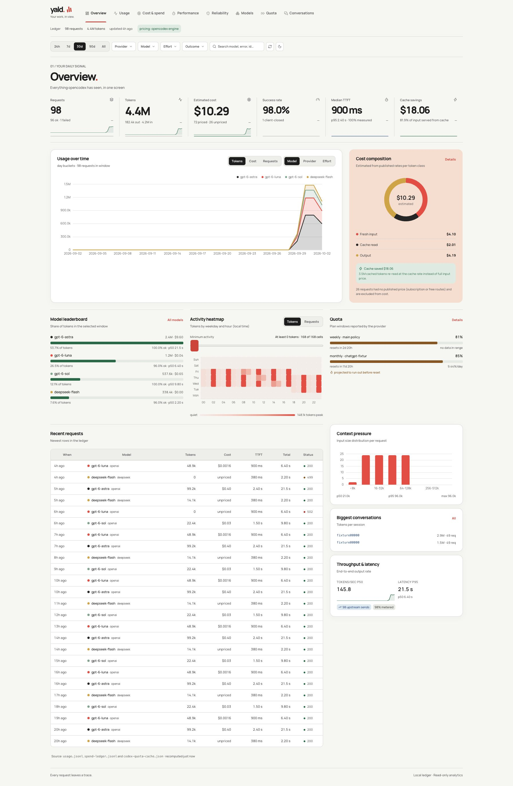

# yald - YetAnotherLlmDashboard

[](https://github.com/Collaboration95/yald/actions/workflows/ci.yml)

A read-only analytics dashboard for [opencodex](https://github.com/lidge-jun/opencodex) and
[Claude Code](https://docs.claude.com/en/docs/claude-code/overview). Both already record everything worth charting — this
puts it on one screen: token volume, estimated spend, cache economics, latency, reliability, quota burn, model comparison
and per-conversation drill-down.

## Supported tools

<table>
  <tr>
    <td align="center" width="140">
      <a href="https://github.com/lidge-jun/opencodex">
        <picture>
          <source media="(prefers-color-scheme: dark)" srcset="https://raw.githubusercontent.com/lidge-jun/opencodex/main/assets/logo-dark.png">
          
        </picture>
      </a>
      <br><b>opencodex</b>
    </td>
    <td>Every request routed through the proxy (Codex, OpenAI-compatible providers, API-key Claude routes), read from
    <code>~/.opencodex</code>. Full metrics: latency, TTFT, effort, retries, quota windows and the spend ledger.</td>
  </tr>
  <tr>
    <td align="center" width="140">
      <a href="https://docs.claude.com/en/docs/claude-code/overview">
        
      </a>
      <br><b>Claude Code</b>
    </td>
    <td>Subscription sessions that never pass through opencodex, read from the session transcripts in
    <code>~/.claude/projects</code> (subagents included). Rows appear as provider <code>anthropic</code> and are priced by
    the same opencodex cost engine. Transcripts have no latency, TTFT, effort, quota or failure data.</td>
  </tr>
</table>

Both sources normalize to the same request rows, so every view, filter and export covers them together.

The dashboard reads the ledgers directly, so it works whether or not the proxy is running. Visible pages poll every 30
seconds, unchanged responses use ETags, and polling pauses in background tabs. The Refresh button forces an immediate re-read.

The desktop UI uses Relay: paper surfaces, ink and coral charts, open numerical summaries, and consistent model colors.
All eight views and conversation detail retain their original data, filters, tables, and drilldowns. Light and dark themes
use your saved preference. Mobile and tablet layouts are outside the supported design scope.



| View | Screenshot | View | Screenshot |
| --- | --- | --- | --- |
| Overview | [PNG](docs/screenshots/overview.png) | Usage | [PNG](docs/screenshots/usage.png) |
| Cost | [PNG](docs/screenshots/cost.png) | Performance | [PNG](docs/screenshots/performance.png) |
| Reliability | [PNG](docs/screenshots/reliability.png) | Models | [PNG](docs/screenshots/models.png) |
| Quota | [PNG](docs/screenshots/quota.png) | Conversations | [PNG](docs/screenshots/conversations.png) |

Regenerate captures with `./scripts/screenshots.sh` (requires Chrome or Chromium). The script uses generated fixture data, a fresh browser profile for each route, and fails on blank or oversized images. The repository social preview source and PNG are in `docs/`.

Preview the production UI with isolated synthetic data using `scripts/bun run preview:fixture` (localhost port 5329;
override with `YALD_PREVIEW_PORT`). It does not read your private ledger. See [Relay verification](docs/relay-ui/README.md).

## Quick start

```bash
make install  # install workspace dependencies
make run      # build the web app, then serve API + UI on one port
# → http://127.0.0.1:4318
```

Run `make` or `make help` to see the available commands. `make dev` starts the API with Vite HMR; `make test`, `make lint`,
`make typecheck`, `make build`, and `make smoke` run the matching checks. `make check` runs the full local verification set.
These Make targets are for a repository checkout; the npm install command below works without Make or a source clone.

The scripts resolve a Bun runtime on their own: `BUN_BIN`, then `bun` on `PATH`, then the runtime bundled inside the
opencodex npm package. Nothing else needs installing beyond `bun install` for dependencies.

Environment variables:

| Variable | Default | Meaning |
| --- | --- | --- |
| `YALD_PORT` (`PORT` fallback) | `4318` | API / UI port |
| `YALD_HOST` (`HOST` fallback) | `127.0.0.1` | Bind address |
| `OCX_HOME` | `~/.opencodex` | Where the ledgers live |
| `CLAUDE_PROJECTS_DIR` | `~/.claude/projects` | Claude Code transcripts; point at an empty directory to leave Claude out |
| `OCX_PACKAGE_DIR` | auto-detected | Location of the installed `@bitkyc08/opencodex` package |
| `YALD_TZ` (`OCX_OBSERVATORY_TZ` fallback) | system timezone | Timezone used for calendar bucketing |

## Install

The first GitHub preview is `v0.1.0`. Install its tested, prebuilt package:

```bash
gh release download v0.1.0 --repo Collaboration95/yald --pattern 'yald-dashboard-0.1.0.tgz'
npm install -g ./yald-dashboard-0.1.0.tgz
yald --version
yald --open
```

After npm registry publication, users can also run:

```bash
npx -p yald-dashboard yald --port 4318 --host 127.0.0.1 --ocx-home ~/.opencodex --open
```

The npm package is named `yald-dashboard` because the unscoped `yald` name is already published by an unrelated package. It exposes the `yald` executable, installs its Bun runtime, and includes the prebuilt web app. Alternatively, clone this repository and run `bun install && ./scripts/serve.sh`. See [distribution steps](docs/releasing.md) for npm publishing and a Homebrew tap.

## Where the numbers come from

| Source | What it gives |
| --- | --- |
| `~/.opencodex/usage.jsonl` | One row per logical request: provider, model, effort, status, TTFT, duration, token classes, attempts, cache provenance, route decision |
| `~/.opencodex/spend-ledger.jsonl` | Physical send accounting — `reserve` → `dispatch` → `settle`, plus `lost` sends |
| `~/.opencodex/codex-quota-cache.json` | Current quota windows and every sample ever captured from provider response headers |
| `~/.opencodex/routing-history.sqlite` | Indexed mirror of the usage rows (not read by default; the JSONL is fresher) |
| `~/.claude/projects/**/*.jsonl` | Claude Code session transcripts: one row per API response with model, token classes, cache reads/writes, thinking tokens and stop reason |

Pricing is not reinvented here. The server imports `@bitkyc08/opencodex/src/usage/cost.ts` at runtime, so every dollar
figure matches `ocx usage` exactly, including your own `ocx models set-price` overlays and long-context rate bands.
If the package cannot be found, the UI keeps working and marks cost as unavailable.

## Views

- **Overview** — KPI row with period-over-period deltas, stacked usage chart (tokens / cost / requests × model /
  provider / effort), cost composition donut, cache savings, model leaderboard, weekday × hour heatmap, quota gauges,
  context pressure, throughput, recent requests.
- **Usage** — token composition over time (cache read vs fresh input vs output vs reasoning), cache hit rate and
  dollars saved, grouped volume by any dimension, large activity heatmap, context-size histogram and breakdown tables.
- **Cost & spend** — spend stacked by model/provider/effort, cost split by token class, cumulative spend, cache savings
  timeline, blended price per 1M tokens, most expensive sessions, cost table with unpriced coverage.
- **Performance** — latency and TTFT percentiles over time, throughput timeline, duration / TTFT / throughput
  histograms, TTFT vs output length scatter, slowest requests, per-model latency table.
- **Reliability** — outcome split, HTTP status codes, attempts-per-request, outcomes over time, error-code table with
  tokens burned, failure rate by model, metering coverage, recent failures.
- **Models** — price vs TTFT scatter (bubble = volume), tokens by provider and model, effort mix, sortable comparison
  table with $/1M, TTFT p50, latency, tok/s, success rate and cache hit rate, effort × model matrix.
- **Quota** — per-window gauges, measured burn rate (%/day), projected exhaustion vs reset time, utilisation history
  per account and window, spend-ledger send/token flow, and a burn table flagging windows that will exhaust before they
  reset. The range selector scopes the history chart, the burn rate and the ledger; current utilisation stays
  point-in-time because that is what the provider reports.
- **Conversations** — sessions ranked by tokens, cost, requests, recency or errors, plus a detail view with cumulative
  token growth against submitted context size, model mix and the request list.

## Ideas worth building next

These came out of the same ledgers and would be straightforward additions:

- **Cache break-even analysis** — for each conversation, how much of the prompt prefix survived between turns, and what
  a different turn cadence would have cost.
- **Model switch timeline** — when a conversation moved between models and what the move cost or saved.
- **Retry cost attribution** — attribute re-sent tokens to the error code that caused the retry.
- **Budget guardrails** — daily/weekly spend targets with projected month-end spend and an alert threshold.
- **Quota simulator** — "what happens to my weekly window if I run this workload", derived from measured tokens/minute.
- **Latency regression detection** — compare each model's p95 against its own trailing baseline and flag shifts.
- **Conversation fingerprints** — cluster sessions by tool-call shape and tokens per turn to find expensive patterns.
- **Hub aggregation** — opencodex supports a remote hub; the same views could aggregate multiple machines.

## Architecture

```
server/src/env.ts              resolves OCX_HOME and the installed opencodex package
server/src/ocx/pricing.ts      imports opencodex's cost engine (with a safe fallback)
server/src/ocx/store.ts        parses usage.jsonl, spend-ledger.jsonl and the quota cache into compact rows
server/src/claude/transcripts.ts  maps Claude Code transcripts onto the same usage rows
server/src/analytics.ts        filtering, bucketing, percentiles, breakdowns, quota projections
server/src/api.ts              Hono routes under /api
server/src/index.ts            boot, static serving, SSE wiring
web/src/pages/*                one file per view
web/src/components/chartOptions.ts  shared ECharts option builders
```

The server checks file identity, size, and precise modification/change times on each API read. Automatic rebuilds reuse
unchanged usage, spend, and quota components; usage reuse also requires an audited, unchanged pricing generation.
Other pricing engines keep the full usage parse. Changed usage and explicit Refresh still reread, price, and sort all rows.
Pages poll every 30 seconds while visible; ETags keep unchanged polls cheap.

See [the refresh experiment](docs/benchmarks/relay-refresh/README.md) for balanced before/after measurements, controls,
raw samples, and the exact scope of the improvement. Browser reload and chart painting are not measured by this experiment.

## Verification

```bash
make test
make lint
make typecheck
make build
make smoke                         # synthetic ledger fixtures
make screenshots                   # requires Chrome or Chromium
make check                         # typecheck, lint, test, build, and smoke
```

The smoke test fails if a page throws, if an expected section is missing, if the HTML contains `NaN`, `Invalid Date`,
`undefined`, `Infinity` or `[object Object]`, or if the quota view stops responding to the range selector.

When `~/.opencodex/usage.jsonl` is missing — a fresh clone or CI — the smoke test generates a synthetic opencodex home
with realistic rows, quota samples and ledger events, so every page is still exercised with data. Expectations are
derived from the API responses rather than hardcoded, so the suite passes against any ledger, including yours.

## Development

```bash
bun install            # install workspace dependencies
./scripts/dev.sh       # API with reload + Vite HMR on :5317
./scripts/serve.sh     # production build served from one port
```

The API is a plain Hono app (`server/src/api.ts`) and can be exercised without a browser, which is what the smoke test
does: it swaps `globalThis.fetch` for the app's own handler and renders each page with React's server renderer.

## License

MIT — see [LICENSE](./LICENSE).

## Reference

- [Metric definitions](docs/metrics.md)
- [API reference](docs/api.md)
- [Architecture and refresh behavior](docs/architecture.md)
- [Performance measurements and recommendations](docs/performance.md)
- [Changelog](CHANGELOG.md)
- [Release procedure](docs/releasing.md)

## Known limits

- `surface` is empty in this installation's rows, so there is no Codex/Claude/Grok split within opencodex rows; the field
  is rendered if it ever appears. Claude Code subscription usage shows up separately as provider `anthropic`.
- Claude Code transcripts record no latency, TTFT, effort, quota or failed calls, so those views stay empty for Claude
  rows and its success rate is always 100%. If Claude Code is also routed through opencodex, those calls are counted twice.
- Requests that failed before any tokens were metered carry no usage, so failure cost shows as zero rather than a guess.
  The Reliability page reports metering coverage instead of inventing numbers.
- Unpriced models (subscription or free routes) are excluded from cost totals and surfaced as an explicit share.
- Quota samples only refresh while the proxy is running; with the proxy stopped you see the last known values.
